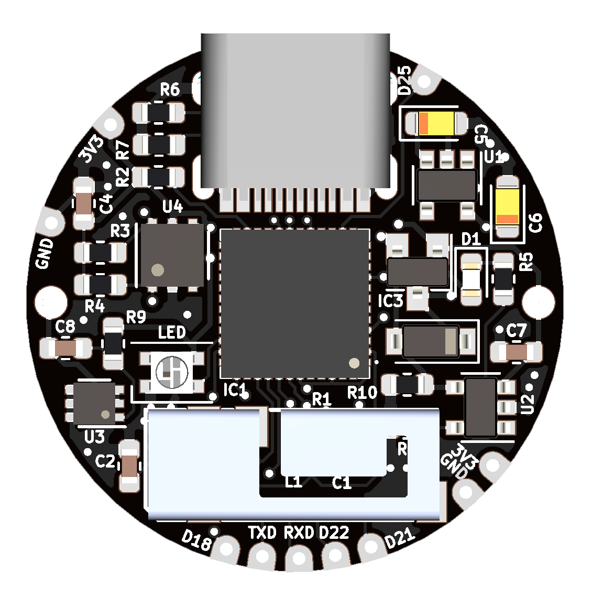

# Open Hardware ESP32

# ESP32-S2-INK

[https://github.com/ketszim97/ESP32_S2_INK](https://github.com/ketszim97/ESP32_S2_INK)

# esp32-c3
](https://github.com/frycaktadeas/esp32-c3))
[https://github.com/ketszim97/ESP32_S2_INK](https://github.com/frycaktadeas/esp32-c3)

# ESPesh

[https://github.com/Charlio99/ESPesh](https://github.com/Charlio99/ESPesh)

